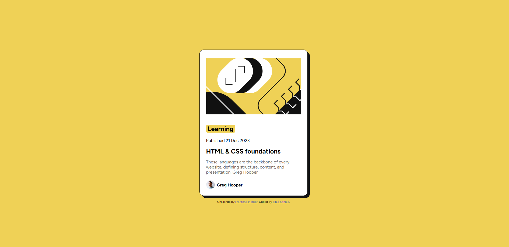

# Frontend Mentor - Blog preview card solution

This is a solution to the [Blog preview card challenge on Frontend Mentor](https://www.frontendmentor.io/challenges/blog-preview-card-ckPaj01IcS). Frontend Mentor challenges help you improve your coding skills by building realistic projects.

## Table of contents

- [Overview](#overview)
  - [The challenge](#the-challenge)
  - [Screenshot](#screenshot)
  - [Links](#links)
- [My process](#my-process)
  - [Built with](#built-with)
  - [What I learned](#what-i-learned)
  - [Continued development](#continued-development)
  - [Useful resources](#useful-resources)

## Overview

### Screenshot

### Links

- Solution URL: [Add solution URL here](https://github.com/Sihle97/blog-preview-card)
- Live Site URL: [Add live site URL here](https://Sihle97.github.io/blog-preview-card)

## My process

### Built with

- Semantic HTML5 markup
- CSS custom properties
- Flexbox

### What I learned

This card was an extension of the qr card so previous comments were considered and I was deliberate in ensuring that the previous mistakes and coding habits were not repeated.

So mastering basics CSS commands and honing my flex-box skills.

### Continued development

Although I was eventually able to figure it out, justify-content and align-items/content still trips me up here and there but I'm getting the hang of it

### Useful resources

- [CSS Tricks](https://css-tricks.com/snippets/css/a-guide-to-flexbox) - Flexboc bible, go to resource for everything flexbox related.
